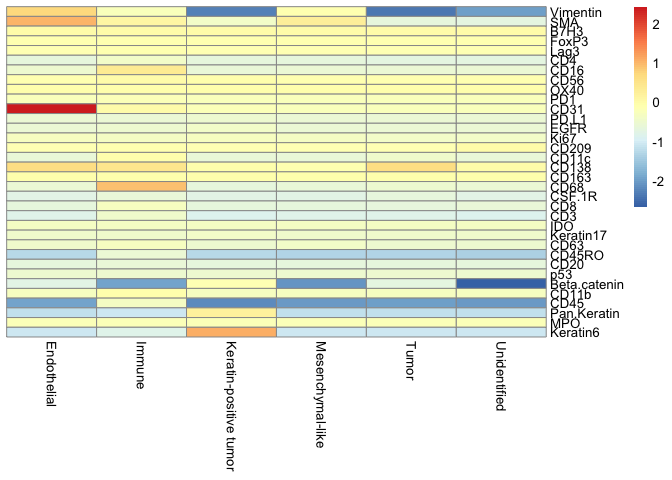

VectraMIBI
================

This is an R package for visualization and supervised cell annotation of
Vectra Polaris and MIBI data. The package provides basic marker
visualization tools like: heat-map and ridge plot. Given a set of
annotated training images, it can also perform a random forest based
cell phenotyping for non-annotated images.

## Loading required packages

First, we load our package: VectraMIBI and a few other required
packages. One can install the developmental version of VectraMIBI by
running the command:
**devtools::install\_github(‘sealx017/VectraMIBI’)**.

``` r

require(VectraMIBI)
require(dplyr)
require(data.table)
require(pheatmap)
require(ggplot2)
require(ggridges)
require(caret)
require(parallel)
require(aricode)
```

## Loading the dataset

Next, we import the training dataset named as “train\_data”, which has
marker data (34 many) for different cells from two different images. The
first two columns: “SampleID” and “cellLabelInImage” of the training
dataset respectively correspond to the image number and the cell label
inside that image. The third column (“Group”) corresponds to the
annotated cell type.

``` r
train_data = read.csv("Data/Training_Data.csv")
head(train_data[,1:5])
#   SampleID cellLabelInImage                  Group Vimentin      SMA
# 1       42                5           Unidentified -0.32535 -0.37796
# 2       42                6       Mesenchymal-like -0.82196 -0.14508
# 3       42                7 Keratin-positive tumor -0.82196 -0.37796
# 4       42                8 Keratin-positive tumor -0.82196 -0.37796
# 5       42                9 Keratin-positive tumor -0.82196  0.18454
# 6       42               10 Keratin-positive tumor -0.82196 -0.37796
```

We also load the full data named as “full\_data” (consisting of 44 many
images). It has all the columns of the training data except “Group”. We
would later predict the type of the cells from this dataset. For running
the code on multiple threads, we also find out the number of cores
(“n\_cores”) of the machine and use it as needed.

``` r

full_data = read.csv("Data/Full_cellData_pruned.csv")
head(full_data[,1:5])
#   SampleID cellLabelInImage Vimentin      SMA       B7H3
# 1        1                2 -0.82196 -0.37796 -0.0070565
# 2        1                3 -0.82196 -0.37796 -0.0070565
# 3        1                4 -0.82196 -0.37796 -0.0070565
# 4        1                5 -0.82196 -0.37796 -0.0070565
# 5        1                6 -0.82196 -0.37796 -0.0070565
# 6        1                7 -0.82196 -0.30990 -0.0070565
n_cores = parallel::detectCores()-1
print(n_cores)
# [1] 15
```

## Summary of cell types

The function displays a table that summarizes the number of cells in
each of the cell types in the training dataset.

``` r
#-----Summary of cell proportions-------------------
summ_cell(train_data)
# 
# 
# |Group                  | total_cells|
# |:----------------------|-----------:|
# |Endothelial            |         132|
# |Immune                 |         807|
# |Keratin-positive tumor |        4574|
# |Mesenchymal-like       |         277|
# |Tumor                  |          14|
# |Unidentified           |          66|
```

## Heatmap of mean marker values

We generate heatmap of the mean marker values (or, mean of
log-transformed marker values) over different cell types from the
training dataset.

``` r
#-----Generate Heatmaps of different kinds------------
dft = train_data[,-c(1,2)]
#genheatmap(df,is.log=FALSE)
genheatmap(dft,is.log=TRUE)
```



## Ridge plot of marker values

Next, we generate image specific ridge plot of a particular marker over
different cells and color by the types. Below, we display the ridge plot
for marker “Vimentin”.

``` r
#------Ridge-plot generator--------------

#interested_traits = c("Vimentin", "SMA", "CD45", "CD31", "Beta.catenin","Keratin6" )
interested_trait = c("Vimentin")
ridge_plotter(train_data,interested_trait,is.log="TRUE")
# Picking joint bandwidth of 0.371
```


## Run random forest

We fit a random forest model on the training dataset. With the fitted
model, we predict the cell-types of the full data.

``` r
df = full_data[,-c(1,2)]
run_train = training_part(train_data = train_data[,-c(1,2)])
RFclassi = run_train$RFclassifier
#result = test_function(full_data, RFclassi)
result= test_function_simple(full_data, RFclassi)
head(result)
# [1] Keratin-positive tumor Immune                 Keratin-positive tumor
# [4] Keratin-positive tumor Immune                 Immune                
# 6 Levels: Endothelial Immune Keratin-positive tumor Mesenchymal-like ... Unidentified
```

## Validation and Clustering performance

To measure predictive performance of the fitted model, one may be
willing to break the training data-set further to create a validation
set and check the prediction performance on that. Here, we randomly
select 20% of the training data as the validation set. We train the
model on the rest of the data and check the predictive performance by
computing Adjusted Rand Index (ARI) and Normalized mutual information
(NMI). For both the indices, closer to 1 values imply better
classification.

``` r
validation_proportion = 0.2
validation_indices = sample(1:dim(train_data)[1],dim(train_data)[1]*validation_proportion)
validation_data = train_data[validation_indices,]
run_train_v = training_part(train_data = train_data[-validation_indices,-c(1,2)])
RFclassi_v = run_train_v$RFclassifier
validation_result = test_function_simple(validation_data[,-3], RFclassi_v)

#ARI
aricode::ARI(validation_result,validation_data$Group)
# [1] 0.9713496

#NMI
aricode::NMI(validation_result,validation_data$Group)
# [1] 0.921866
```
